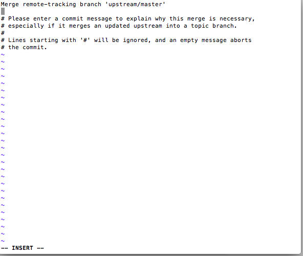

# How to Fetch Dev Bootcamp's Curriculum Changes 

Dev Bootcamp makes modifications and edits to the curriculum often. When this happens you'll need to "fetch" the changes from Github.com into your personal repository. This can be confusing to do, so thankfully, we've created this handy guide for you to do it via the command line or GitHub app.

It's important to note that **fetching changes will NOT override your work.** On the rare occasion we do modify a 'my_solution' file, you may have a merge conflict. All you'll have to do is select which parts you want. This is not likely to happen, so don't worry about it much. 

Navigate to the appropriate directory in your terminal. Make sure you are in the **master branch** of the repo you want to update (`phase-0-unit-1`, `phase-0-unit-2`, or `phase-0-unit-3`). Check this by running `git branch` in your terminal. DO NOT try fetching changes into a different repo (than the one you want to update) or your [USERNAME].github.io repo. You will mess things up!

## Updating your local repository
You have a couple of steps to add changes from Devbootcamp's repository. First, verify you have your remotes set up properly by typing `git remote -v` into the command line from the repository directory. You should see something approximating the following:

```shell
$ git remote -v

# origin    https://github.com/[your_username_here]/repo.git (fetch)
# origin    https://github.com/[your_username_here]/repo.git (push)
# upstream  https://github.com/Devbootcamp/phase-0-unit-1.git (fetch)
# upstream  https://github.com/Devbootcamp/phase-0-unit-1.git (push) # You do not want to push to this repository!
```

If you have the upstream fetch and push defined and they link to the Devbootcamp repo, you are ready to move on. If you don't have this, go to the "Setting up Remotes" section at the bottom of this page to set up the proper remotes. 

###1. Fetch the Changes
Fetching from Devbootcamp's remote repository will bring in Devbootcamp's changes into a special branch in your local repository. **Note: it's not merged yet.** This command will fetch all changes made in the repository by Dev Bootcamp. This is fine. There is no need to try to only fetch changes for a specific file or week. 

```shell
$ git fetch upstream
# Grab the upstream remote's branches
# remote: Counting objects: 75, done.
# remote: Compressing objects: 100% (53/53), done.
# remote: Total 62 (delta 27), reused 44 (delta 9)
# Unpacking objects: 100% (62/62), done.
# From https://github.com/Devbootcamp/phase-0-unit-1
#  * [new branch]      master     -> upstream/master

```

Now the upstream's master branch is stored on your local branch, `upstream/master`

```shell
$ git branch -va
# List all local and remote-tracking branches
# * master                  a422352 My local commit
#   remotes/origin/HEAD     -> origin/master
#   remotes/origin/master   a422352 My local commit
#   remotes/upstream/master 5fdff0f Devbootcamp's latest commit

```

###2. Merge the changes
Now that you have Dev Bootcamp's changes stored in your local repository, you need to merge the changes with yours. 

First make sure you are on your master branch. 

```shell
$ git branch
* master

#OR

$ git checkout master
# switch to your master branch
```

Then merge the changes. This will bring your master branch into sync with Dev Bootcamp's master branch - and you won't lose your local changes. 

```shell
$ git merge upstream/master
# Merges upstream's master into your local forked repository
```

If you did not have any un-synced commits, git will perform a "fast-forward". 

Sometimes git will open up a Vim or Sublime window and ask for a commit message. If you're in Sublime, you can simply save and quit, or change the top line with a commit message you choose - then save and quit. 

If you have a weird window pop up that looks like this: 

You'll want to go back to the week 1 computer set up instructions and make sure Sublime is set up as your default text editor.

###3. Commit and push your new local repository with your remote fork on github.com

```shell
$ git commit -m "added Dev Bootcamp's changes"

$ git push origin master
# origin refers to the name of the remote repo
# master refers to the name of the branch you are pushing

```

###4. Check github.com!
Look at your master branch on github.com. It should have your changes!

## Setting Up Remotes
*(Adapted from [GitHub](https://help.github.com/articles/syncing-a-fork)).*

### Setting up a new remote (link to a repository hosted on github.com)
*You'll only need to do set up a remote once!*

####1. Check where you are in your terminal!
Type `pwd` to see which directory you are in. Make sure you are in the correct directory for fetching. You want to make sure all of your phase-0 repositories and your github.io sites are all separate. If you do not check where you are, you will likely make a mistake and cause a lot of problems. 

####2. Check your current remote. This should link to your personal fork. 

```shell
$ git remote -v
# List the current remotes
# origin  https://github.com/[your_username_here]/repo.git (fetch)  #This will either have https or ssh url
# origin  https://github.com/[your_username_here]/repo.git (push)

```

####3. Set up a new remote

```shell
$ git remote add upstream https://github.com/Devbootcamp/phase-0-unit-1.git 
# You are adding Devbootcamp's repository saying you want to be able to fetch (grab changes) from it.

```

####4. Verify your new remote

```shell
$ git remote -v

origin    https://github.com/[your_username_here]/repo.git (fetch)
# origin    https://github.com/[your_username_here]/repo.git (push)
# upstream  https://github.com/Devbootcamp/phase-0-unit-1.git (fetch)
# upstream  https://github.com/Devbootcamp/phase-0-unit-1.git (push) # You do not want to push to this repository!
```
