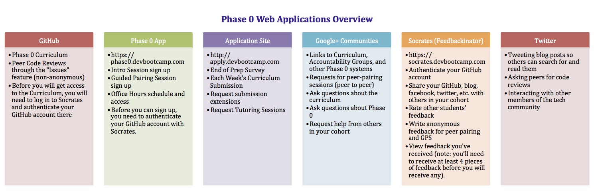

[Table of Contents](README.md)

We ask you to use many different web applications during Phase 0. These are in the process of being consolidated into a portal to improve the student user experience, but we aren't there yet. It can be pretty overwhelming to get used to all of these different applications, on top of learning to code, so we wanted to provide an overview of each system so you can familiarize yourself with each sooner and make the transition into Phase 0 easier.

# 1. GitHub
Dev Bootcamp uses GitHub to host its curriculum. Due to the nature of the program, the curriculum repositories are private, which means that students will be unable to get access to the curriculum until their GitHub name is added to a team or organization.

All members of a team or organization will have access to each other's work, but all repositories must remain private based on the student agreement.

In order to get your GitHub name associated with your account, we need each student to prioritize linking their GitHub account in Socrates as soon as they get the email. Our systems rely on Socrates data, so this step is very important.

# 2. Phase 0 App
[https://phase0.devbootcamp.com](https://phase0.devbootcamp.com)

You will sign up for Intro Sessions, Guided Pairing Sessions (GPS), and view and enter [office hours](office-hours.md) through the app.  Once you receive your email invite to the app, follow the link to activate your account.

You must use the SAME GitHub name in your activation as the one you authenticated with on Socrates. If these are mis-matched or you revoked access, you will be unable to log in.

## Intro Sessions

The app should make signing up for sessions fairly simple. Simply click "Sign Up for an Intro Session" to view available times and sign up for a session. You should receive an email confirmation. Keep in mind, Intro Sessions are orientation meetings held the first week of Phase 0. Because they are conducted by staff members, they are only offered during business hours. They are mandatory, so be sure to make any necessary accommodations to be able to attend.

## Guided Pairing Sessions (GPS)
There are 6 mandatory GPS as part of the Phase 0 curriculum. Each session is offered during specific weeks. All sessions will be posted Friday at noon PST before the week starts. (Weeks begin on Monday). It is the responsibility of each student to make it a priority to sign up for sessions as soon as possible. There are only enough sessions made so each person can attend one. There are no extra sessions. Please make it your priority to sign up each week by Saturday.

To sign up for GPS, select the GPS you want to sign up for, click the "Sign Up" button to see available times, then click "Sign Up" again next to the session you would like to sign up for. You will receive an email confirmation. When you need to enter the session either follow the link in the email or return to the app to join the session.

# 3. Application Site
[http://apply.devbootcamp.com](http://apply.devbootcamp.com)

Phase 0 uses the Dev Bootcamp application site to track progress throughout Admissions and Phase 0.

Each week, you will be directed to submit links to your work, provide the hours you spent on the curriculum, conduct a self-assessment of the learning competencies, and provide optional feedback through the application site.

Submitting work in this way is an honor code validation. We do not check each submission to ensure you've completed it. By submitting your work, you are affirming you have completed each challenge to our standards. We occasionally spot-check submissions.

If you need to request tutoring sessions or an extension you will need to complete a form on this site as well.

# 4. Google+ Communities
Google+ Communities are the hub for cohort communication, mass communication from Phase 0 staff, and a place for you to ask questions. Each community will have a set of links to the curriculum and other important sites under the "About this Community" section.

Currently, pairing requests are mainly handled in the communities under the "Pairing Requests" discussion board.

You can receive email notifications for each post that is posted (unfortunately you cannot enable them only for certain threads, that's an issue with Google+).

You should check the community every day. Staff makes announcements largely in the "Curriculum" and "Announcements from DBC" boards. It is each person's accountability to keep up to date with what is posted there.

# 5. Socrates (Feedbackinator)
[https://socrates.devbootcamp.com/feedback](https://socrates.devbootcamp.com/feedback)

Because pairing is important in Phase 0 and at Dev Bootcamp on site, improving pairing skills will be something you want to work on. In order to help every person get a better feel for how they are doing, it is required that each person write feedback for every pairing session they complete (GPS or peer-pairing). There is more information about [feedback](feedback.md) and [pairing](pairing-in-phase-0.md) elsewhere in the handbook.

Socrates used to be a student hub for curriculum, but is currently only used for Feedback and viewing your local cohort. Each person should complete their profile when they log in to Socrates.

# 6. Twitter
We use Twitter for sharing blog posts with others in the DBC and specifically Phase 0 community through the use of unique hash tags. We decided to use Twitter for this because the Google+ Community was getting over-run and students in other cohorts and DBC staff could not access student's blogs easily.

We understand that some students have never used Twitter and are reluctant to do so. It is, nevertheless, required that Phase 0 students use Twitter during Phase 0.

For students who have developed a personal brand and followers on Twitter, you may decide to create an account just for your developer side where you will post this work.

You should also feel free to use the link to the massive twitter feed (linked in the Google+ Community) to see what others have written.

If you would like others to look at your code and give them feedback, we suggest doing this on Twitter because it makes it a bit easier for others to find the links. Because your repositories are private, only other Phase 0 students and staff will be able to see your work.

#7. Class Marker (Not pictured)
This is where weekly quizzes are hosted and will be taken. You will need to log in with the email address you have associated with Dev Bootcamp. 
